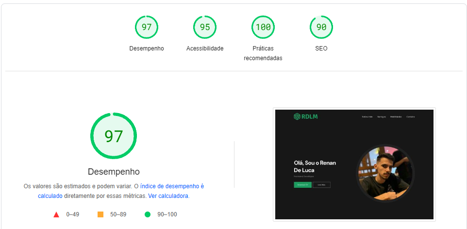

<h1 align="center">
Portfólio
</h1>
<p align="center">
  <a href="#-tecnologias">Tecnologias</a>&nbsp;&nbsp;&nbsp;|&nbsp;&nbsp;&nbsp;
  <a href="#-projeto">Projeto</a>&nbsp;&nbsp;&nbsp;|&nbsp;&nbsp;&nbsp;
  <a href="#-como-rodar">Como rodar</a>&nbsp;&nbsp;&nbsp;|&nbsp;&nbsp;&nbsp;
  <a href="https://portfolio-rdlm.vercel.app" target="_blank">Acesse o site</a>
</p>

<br>


## 🚀 Tecnologias

Esse projeto foi desenvolvido com as seguintes tecnologias:

- [Vite](https://vitejs.dev/)
- [React JS](https://pt-br.reactjs.org/)
- [TypeScript](https://www.typescriptlang.org/)
- [UseForm](https://react-hook-form.com/docs/useform)
- [zod](https://zod.dev)
- [StyledComponents](https://styled-components.com/)
- [Material-UI](https://mui.com/material-ui/)
- [React-Sroll](https://www.npmjs.com/package/react-scroll)
- [React-Spring](https://www.react-spring.dev/)
- [React-Intersection-Oberserver](https://www.npmjs.com/package/react-intersection-observer)

## 💻 Projeto

<p>
Esta aplicação funciona como um portfólio que oferece informações sobre minha pessoa, destacando minhas habilidades, experiências, formação acadêmica e projetos pessoais. Além disso, serve como um meio de entrar em contato comigo. Durante o desenvolvimento desta aplicação, aproveitei a oportunidade para aprimorar minhas habilidades no React e em outras bibliotecas. Isso inclui a implementação de eventos de renderização de componentes à medida que o usuário rola a página, bem como a criação de formulários estilizados em conjunto com os componentes do Material UI. Vale ressaltar que a aplicação é totalmente responsiva e compatível com qualquer dispositivo ou navegador.
</p>

## 🧱 Funcionalidades
<ul>
<li>Animação de renderização dos componentes ligadas ao scroll</li>
<li>Animação de suavização dos links da Navbar</li>
<li>Animação de zoom sobre alguns componentes</li>
<li>Botão de Scroll to Top, para retornar ao topo suavemente</li>
<li>Download do currículo</li>
<li>Formulário com validação e personalização de cada erro</li>
<li>Aplicação responsiva compatível com qualquer dispositivo e navegador</li>
<li>Uso de componentes do Material UI, assim como criação de um tema</li>
</ul>

## 🚀 Desempenho 
</img>

##  🖼 Confira a Demo

<p> <a href="https://portfolio-rdlm.vercel.app" target="_blank"> Confira o site </a> </p>

## 🔧 Como rodar

### 🗂 Faça um clone do projeto

```bash
git clone https://github.com/RenanLuca/portfolioRDLM.git
```

### 📥 Instale as dependências
```bash
# Acesse o diretório do projeto
cd portfolioRDLM

# Instale as dependências
yarn 
```

### ⚡ Inicie a aplicação
```bash
yarn run dev
```

Me adicione no [LinkedIn](https://www.linkedin.com/in/renanLuca/) :wave:
